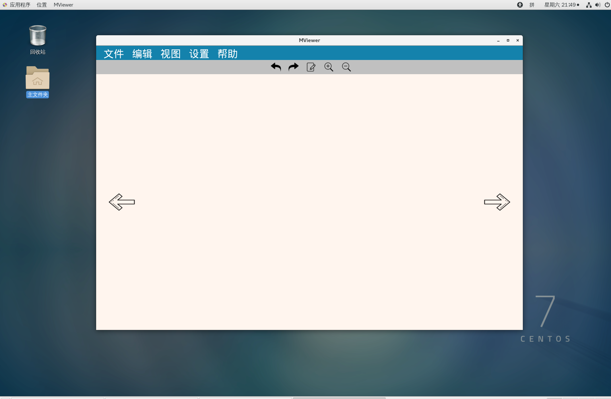
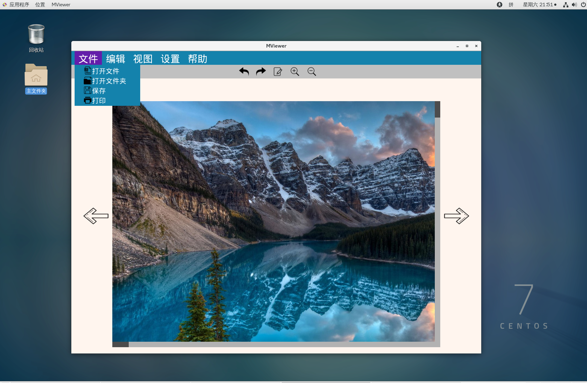
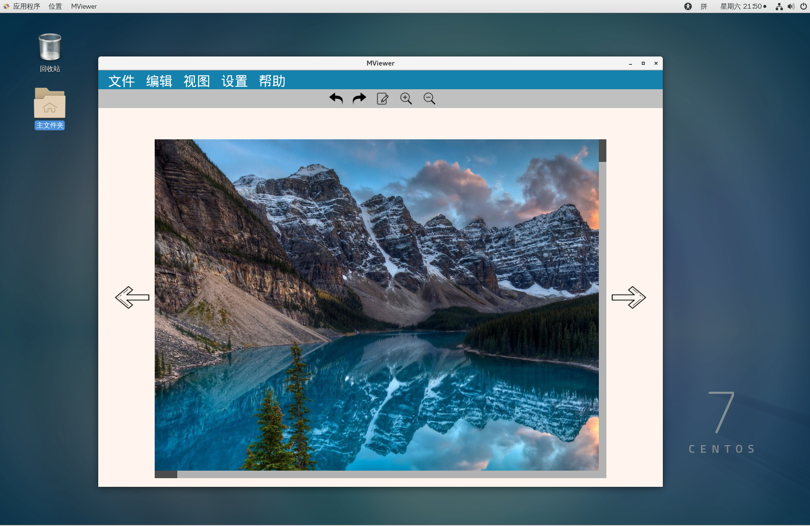
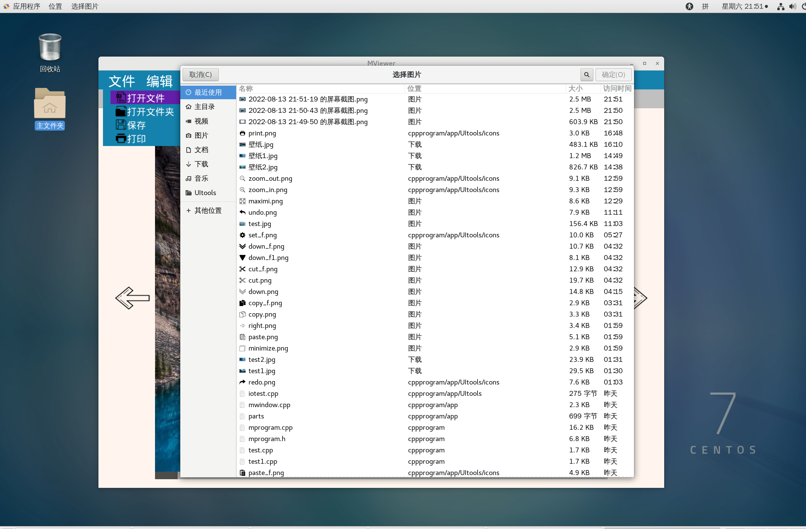
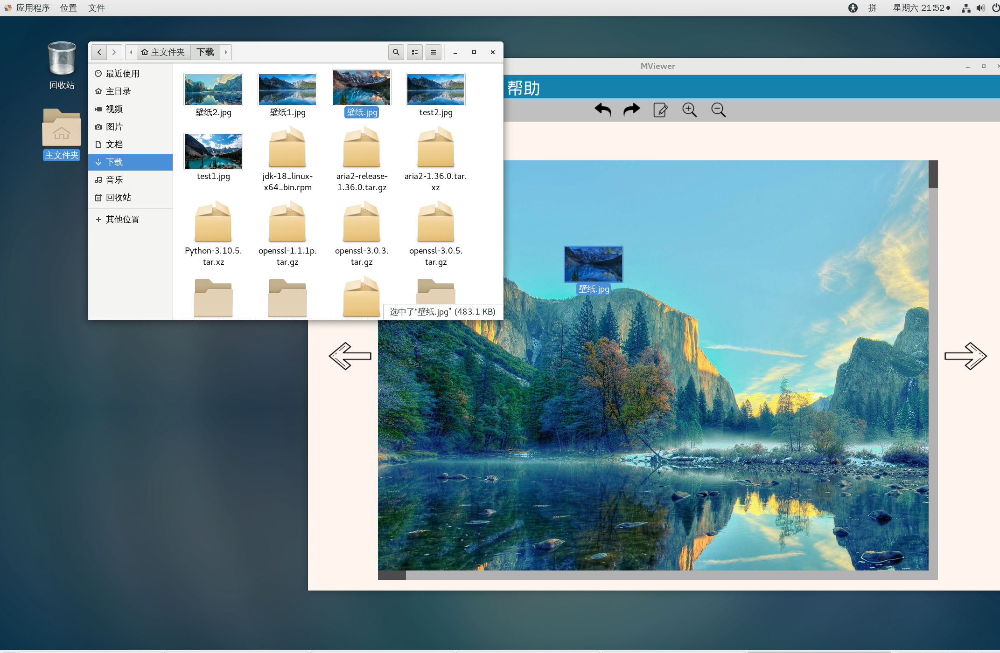
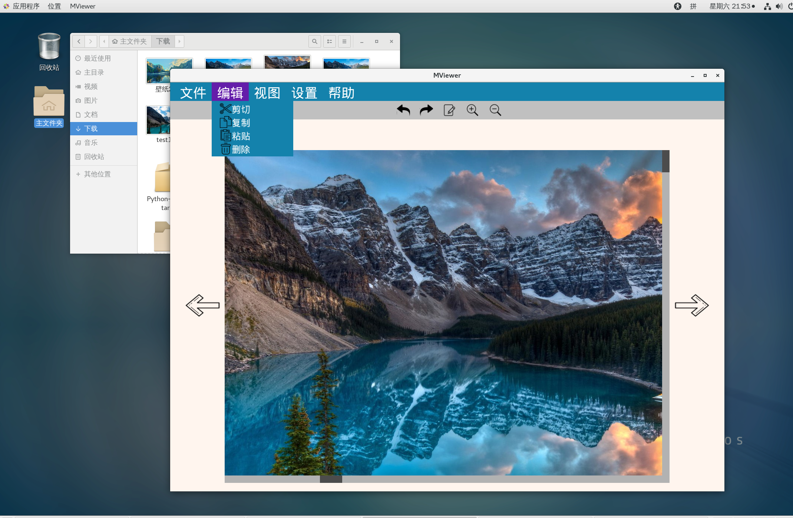

## 概述
>这是一个练手项目，直接使用OpenGL进行渲染的UI模块，不使用任何第三方绘图库，仅使用一个窗口库
提供OpenGL渲染所需的基本窗口上下文,现代c++语言编写。具备图片显示、文字渲染、鼠标
键盘交互等基本UI功能，并基于此随便写了个图片查看器（示例见下文），后续会添加曲线
和复杂图形的绘制，。由于编写时间仓促，加上初学 OpenGL和c++,未进行详细的测试，
只保证基本功能的实现，以后慢慢完善！
---
 功能特色
-------------
>* 体积小巧:  使用此模块编写的图片查看器经 GCC12 编译后只有1MB；
>* 依赖少、安装方便：只依赖1个第三方窗口库GLFW和3个仅头文件的库
   > 处理不同格式的图片和字体文件以及多维矩阵运算
>* 使用简单：提供简单一致的接口，处理不同的类型
>* 现代c++编写：使用C++11及其后的版本编写

---
##图片示例
>Mviewer的截图，随便写的代码，只是展示一下UI模块的功能








##依赖项
这些第3方库的文件放置在third_lib_h和third_lib文件夹，编译时确保文件夹在默认库搜索路径中
>- GLFW——提供OpenGL渲染上下文及简单窗口管理，跨平台支持
>- glm——头文件，渲染用到的矩阵变换运算以及与GLSL(着色器语言)较一致的类型表示
>- stb_image——一个小巧的头文件，从不同格式的图片文件读取数据
>- freetype2——仅包含头文件的库，从不同格式的字体文件读取数据
>- X Window环境——大多数Linux发行版的默认桌面环境
>- OpenGL开发环境——见OpenGL官网，有详细说明  
---
## 编译
暂时没去了解makefile和配置脚本的写法，只能用最原始的方法编译，将仓库里的.cpp和.c文件加上，再链接动态库就OK
``` xml
mprogram.cpp mglyph.cpp glad.c -lglfw3 -lGL -lX11 -lpthread  -ldl -lfreetype
```

---
## 使用方法
``` xml
#include "mparts.h"
```

### 注意事项
没使用namespace，可能会有命名冲突，错误仅简单控制台输出，有时间再写一个日志记录模块

---

## License
>本项目使用GNU LGPLv2 协议，请遵守
